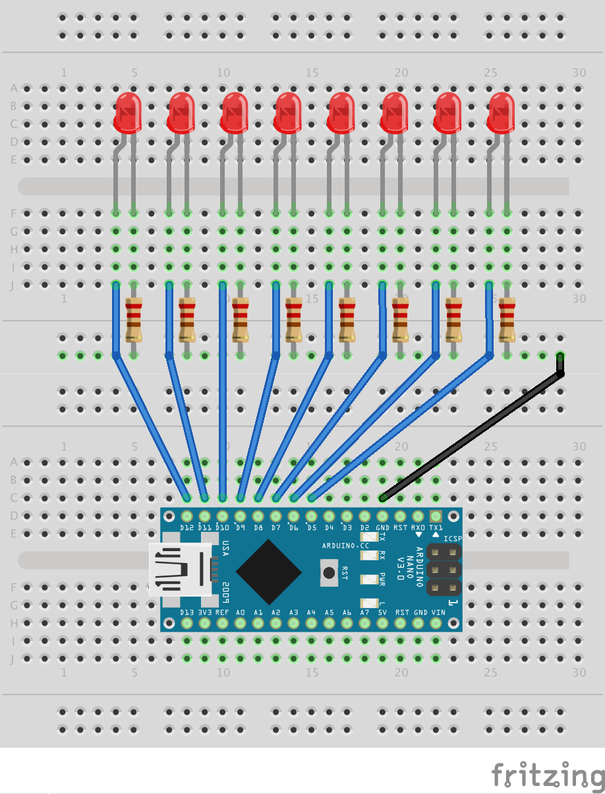
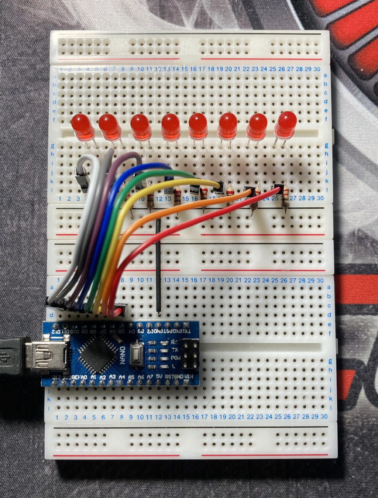

# Implémentation d'un chenillard à 8 LEDs

L'objectif de cet atelier est de vous faire découvrir la programmation d'une carte Arduino avec l'environnement de développement PlatformIO. Pour cela, je vous propose de réaliser un petit circuit électronique sur une platine de prototypage (*breadboard*) en connectant une rampe de 8 LEDs à une carte Arduino. J'utilise ici une carte [Arduino Nano][nano], mais vous pouvez tout à fait réaliser le même montage avec une carte [Arduino Uno][uno]. Le raccordement des LEDs sur les broches de commandes numériques de la carte Arduino est exactement le même.

<table>
    <tbody>
        <tr>
            <td></td>
            <td></td>
        </tr>
    </tbody>
</table>


## Schéma de câblage du prototype

Les anodes (+) de chaque LED sont respectivement reliées, dans le même ordre, aux broches **D5** à **D12** (de droite à gauche) de la carte Arduino. Les cathodes (-), quant à elles, sont toutes reliées à la masse, c'est-à-dire à la broche **GND** de la carte Arduino, au travers d'une résistance de **220 Ω** pour limiter l'intensité du courant qui traversera les LEDs, et les protéger d'une dégradation qui leur serait fatale.

On utilisera ici deux platines de prototypage pour que le câblage ne soit pas trop étriqué :

<table>
    <tbody>
        <tr>
            <td></td>
            <td></td>
        </tr>
    </tbody>
</table>


## Configuration du projet PlatformIO

La configuration du projet est définie par les directives inscrites dans le fichier `platformio.ini` :

```ini
[env:led-strip]
platform  = atmelavr
board     = nanoatmega328
framework = arduino
```

Le projet est ici configuré pour être téléversé sur une carte Arduino **Nano**. Si, de votre côté, vous utilisez une carte Arduino **Uno**, vous devez remplacer la désignation de la carte `board` par la valeur `uno` :

```ini
[env:led-strip]
platform  = atmelavr
board     = uno
framework = arduino
```


**Bon code !**


[nano]: https://store.arduino.cc/arduino-nano
[uno]:  https://store.arduino.cc/arduino-uno-rev3